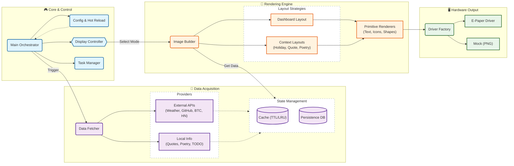

<div align="center">
    

Powered by Pi, rendered in Pixels.

# Paper Pi

[](https://github.com/palemoky/paper-pi/actions)
[](https://hub.docker.com/r/palemoky/paper-pi)
[](https://github.com/palemoky/paper-pi)
[](https://www.python.org/)
[](https://github.com/palemoky/paper-pi)

A modern, modular, and highly customizable dashboard for Waveshare E-Ink displays. Built with Python 3.14+ using async/await patterns and a clean, testable architecture.

</div>

## 🚀 Quick Start with Docker

The easiest way to run is using Docker - it handles all dependencies and driver setup automatically.

<div align="center">
    
</div>

## Screenshots

### 📊 Dashboard

| Todo                                                                                                  | HackerNews                                                                                                        |
| ----------------------------------------------------------------------------------------------------- | ----------------------------------------------------------------------------------------------------------------- |
|  |  |

### 🥷 Other Modes

| Quote                                                                                         | Poetry                                                                                          | Wallpaper                                                                                             | Year-End Summary                                                                                                    |
| --------------------------------------------------------------------------------------------- | ----------------------------------------------------------------------------------------------- | ----------------------------------------------------------------------------------------------------- | ------------------------------------------------------------------------------------------------------------------- |
|  |  |  |  |

### 🎉 Special Days

| Happy Birthday                                                                                      | Anniversary                                                                                               | Valentine's Day                                                                                                  |
| --------------------------------------------------------------------------------------------------- | --------------------------------------------------------------------------------------------------------- | ---------------------------------------------------------------------------------------------------------------- |
|  |  |  |

| Happy New Year                                                                                            | Spring Festival                                                                                                   | Mid-Autumn Festival                                                                                                       | Christmas                                                                                             |
| --------------------------------------------------------------------------------------------------------- | ----------------------------------------------------------------------------------------------------------------- | ------------------------------------------------------------------------------------------------------------------------- | ----------------------------------------------------------------------------------------------------- |
|  |  |  |  |

### Pull and Run

```bash
# Pull the latest image
docker pull palemoky/paper-pi:latest

# Or use GitHub Container Registry
docker pull ghcr.io/palemoky/paper-pi:latest

# Run with docker-compose (recommended)
git clone https://github.com/palemoky/paper-pi.git
cd paper-pi
cp .env.example .env
# Edit .env with your API keys

# For dashboard/quote/wallpaper modes (default)
docker-compose up -d
```

### Supported Platforms

- `linux/arm64` - Raspberry Pi 3/4/5 (64-bit)

## ✨ Features

### 📊 Dashboard Widgets

- **Custom To-Do Lists** - Three customizable lists (Goals/Must/Optional) with strikethrough for completed items
- **HackerNews** - Auto-rotating top stories with pagination and configurable display time ([Live Mirror](https://gist.github.com/palemoky/b04f3dcfb8431784cddc648d1af6dd4c))
- **Real-time Weather** - OpenWeatherMap integration with icon support
- **GitHub Contributions** - Daily/Weekly/Monthly/Yearly stats with grid layout
- **Bitcoin Price** - Live BTC price with 24h change percentage
- **VPS Data Usage** - Monitor your server's data consumption
- **Weekly Progress** - Visual progress ring for the current week

### 🎨 Display Modes

- **Dashboard** - Main information display with time-based TODO/HN switching
- **Quote** - Inspirational quotes
- **Poetry** - Classical Chinese poetry
- **Holiday Greetings** - Auto-triggered on special days
- **Wallpaper** - Custom images

### 🎉 Smart Features

- **Year-End Summary** - Automatic GitHub contribution summary on Dec 31st
- **Holiday Detection** - Auto-displays greetings for:
  - Birthdays & Anniversaries (configurable)
  - Lunar New Year (Spring Festival)
  - Mid-Autumn Festival
  - New Year's Day & Christmas
- **Time-based Switching** - Configurable time slots for TODO lists vs HackerNews
- **Quiet Hours** - Configurable sleep period (e.g., 1 AM - 6 AM)
- **Grayscale Support** - 4-level grayscale for enhanced visual quality (white/light gray/dark gray/black)
- **Audio Notifications** - [Xiaomi speaker](https://github.com/palemoky/xiaomi-speaker) [integration](https://github.com/palemoky/xiaomi-speaker-action) for alerts and announcements

### 🏗️ Modern Architecture

- **Async/Await** - Built with `asyncio` and `httpx` for concurrent operations
- **Modular Design** - 23+ focused modules following Single Responsibility Principle
- **Type Safety** - Full type hints with mypy validation
- **Plugin System** - Extensible display mode system
- **Event Bus** - Decoupled component communication
- **Smart Caching** - TTL-based caching with LRU eviction
- **Unified Retry** - Automatic retry with exponential backoff using `tenacity`
- **Task Management** - Async task lifecycle management
- **Config Hot Reload** - Runtime configuration updates with `watchdog`
- **Graceful Shutdown** - Proper SIGTERM/SIGINT handling

### 🧪 Quality & Testing

- **Unit Tests** - 90+ tests with 66% overall coverage
- **Core Modules** - 77%+ coverage on critical components
- **CI/CD** - Automated testing, type checking, and Docker builds via GitHub Actions
- **Type Checking** - Full mypy validation with strict mode
- **Code Quality** - Ruff linting and formatting
- **Pre-commit Hooks** - Automated code quality checks before commits
- **Mock System** - CLI tool for generating test images without hardware

## 🏛️ System Architecture

The E-Ink Dashboard follows a modular, event-driven architecture with clear separation of concerns:



## 🔑 Token Sync (macOS → Raspberry Pi)

When your tokens are only available on macOS (Keychain/local auth files), use file-based secrets and sync them to Raspberry Pi:

1. Configure Docker to mount host secrets directory as read-only (already included in `docker-compose.yml`):

```yaml
volumes:
  - ${PAPER_PI_SECRETS_DIR:-./secrets}:/run/secrets:ro
```

2. Set token file environment variables in `.env`:

```bash
CLAUDE_OAUTH_TOKEN_FILE=/run/secrets/claude_oauth_token
CHATGPT_OAUTH_TOKEN_FILE=/run/secrets/chatgpt_oauth_token
KIMI_API_KEY_FILE=/run/secrets/kimi_api_key
```

3. From your macOS machine, install the launchd sync daemon:

```bash
# install
./scripts/install_launchd.sh

# view logs
tail -f /tmp/sync_ai_tokens.log

# uninstall
./scripts/install_launchd.sh uninstall
```

> **Note**
> - The app reads token files on every usage query (no restart needed after token refresh).
> - If a usage request returns non-200 (token likely expired), that provider switches to `--` fallback and pauses further requests with the same token until a new token is synced.
> - Secret files are mounted read-only in container and written only on Raspberry Pi host.

## 🖥️ Hardware Support

- **Primary**: Waveshare 7.5inch E-Paper HAT (V2)
- **Other Models**: Configurable via `EPD_MODEL` env var (supports most models in the [official repo](https://github.com/waveshareteam/e-Paper))
- **Platform**: Raspberry Pi (Zero/3/4/5) or any Linux board with SPI/GPIO

## 🙏 Acknowledgments

- [Antigravity](https://antigravity.google/) for the pair programming
- [Waveshare](https://www.waveshare.com/) for E-Ink display drivers
- [Chinese Poetry](https://github.com/chinese-poetry/chinese-poetry), [LxgwWenKai](https://github.com/lxgw/LxgwWenKai), [Hanyi](https://hanyi.com.cn/) for poetry
- [Flaticon](https://www.flaticon.com/), [Weather Icons](https://github.com/erikflowers/weather-icons) for icons
- [CoinGecko](https://www.coingecko.com/) for BTC price
- [OpenWeatherMap](https://openweathermap.org/) for weather
- [Figma](https://www.figma.com/) for UI design
- [CodexIsland](https://github.com/ericjypark/codex-island) and [BluETag](https://github.com/yihong0618/bbtag) for AI token usage

- All the open-source libraries that make this project possible
